# AI-SupportOps

[](https://github.com/vipul2902/AI-SupportOps/actions/workflows/ci.yml)
[](LICENSE)

**AI-SupportOps is a multi-tenant SaaS platform for AI-powered customer support.** Companies upload their documentation and get answers grounded in it, with verified citations. An AI agent can also work support tickets, but only through validated, role-checked and audited tools.

.NET 10 modular monolith · PostgreSQL + pgvector · Redis · OpenAI · React 19 · Docker · GitHub Actions · Azure Container Apps

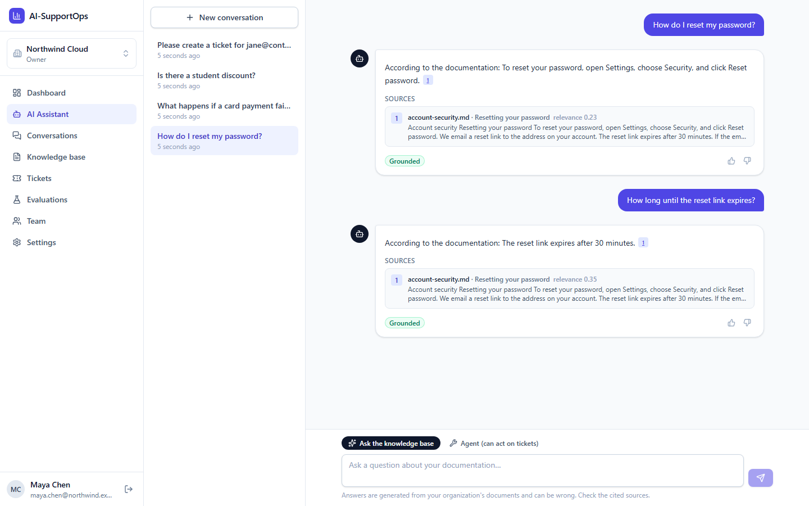

## 1. Project overview

AI-SupportOps is a complete product, not a notebook demo. It provides:

- organizations with roles and invitations;
- a document knowledge base with background ingestion;
- retrieval-augmented answers that stream token by token, with sources;
- a support ticket system;
- an AI agent that acts on that ticket system;
- an evaluation harness that scores answer quality offline (in CI) and online.

Everything is tenant-isolated, observable through OpenTelemetry, and deployable with one Bicep template.

## 2. Problem being solved

Support teams answer the same questions over and over, even though the answers already sit in their documentation. Generic chatbots make this worse in four ways:

- They **hallucinate**, answering confidently without a source.
- They **leak** data across customers when a single index serves everyone.
- They **cannot act**, or they act with no permission checks.
- **Nobody measures** whether the answers are any good.

AI-SupportOps answers only from the tenant's own documents. It cites sources and says "I don't know" when retrieval finds nothing relevant. It lets the AI take actions only through the same authorization rules as a human user. And it measures retrieval and answer quality as a build gate.

## 3. Key features

| Area | What it does |
|---|---|
| Multi-tenancy | Organizations, Owner/Admin/Agent/Viewer roles, invitations, and tenant switching. EF Core global query filters plus a write guard enforce isolation. |
| Knowledge base | Upload PDF, DOCX, Markdown or TXT. A background worker extracts, normalizes, chunks (heading-aware) and embeds the text. Chunks can be inspected per document. |
| RAG answers | Tenant-filtered vector search with a relevance threshold, a token-budgeted context, versioned prompts, and citation verification. When nothing is relevant, the system abstains instead of guessing. |
| Streaming chat | Server-Sent Events. Conversations persist, follow-up questions are rewritten into standalone ones, and long histories are summarized. |
| Support tickets | Workflow state machine, per-tenant ticket numbers, optimistic concurrency, field-level history, and an audit log. |
| AI agent | Tool calling (search, ticket read/create/update, customer lookup). The tools offered depend on the user's role, and every call is authorized, schema-validated, budgeted and recorded. |
| Evaluation | Labelled dataset scored on Hit@K, MRR, citation accuracy, key facts, abstention and LLM-judge groundedness. Online metrics and thumbs-up/down feedback. |
| Security | Short-lived JWT plus rotating refresh tokens (reuse detection) in an httpOnly cookie, a CSRF guard, account lockout, Redis rate limits, security headers, and trusted proxy configuration. |
| Operations | OpenTelemetry traces, metrics and logs, with GenAI spans. Health checks, hardened containers, CI quality gates, GHCR images, and an Azure deployment over OIDC. |

## 4. Screenshots

> These screenshots were captured from the production Docker stack using the **offline Fake AI provider** (deterministic embeddings and templated answers), so no API key was involved. With `Ai__Provider=OpenAI`, the same screens show real model output.

| | |
|---|---|
| 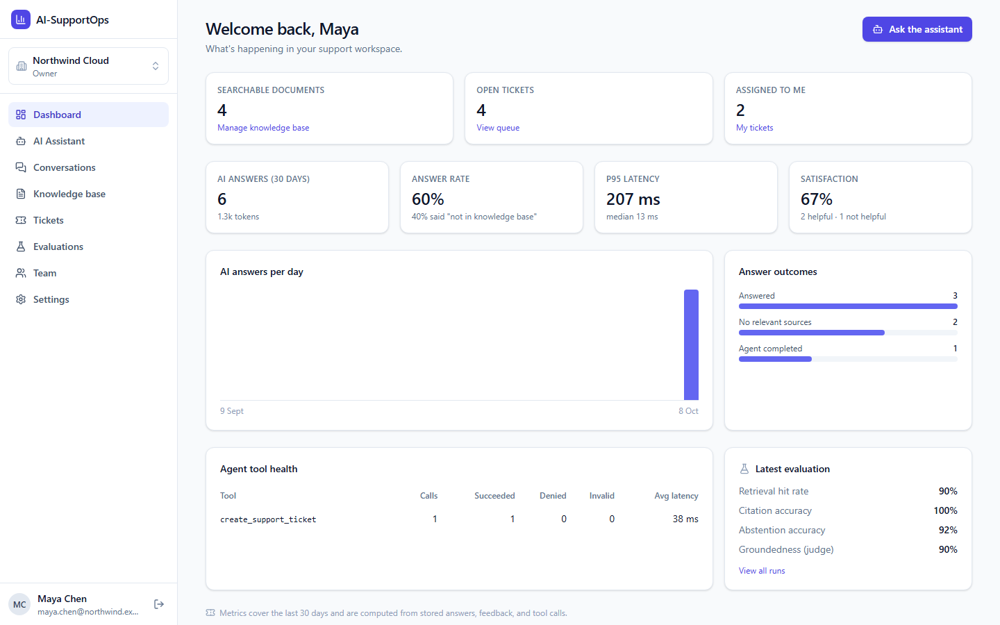 **Dashboard**: answer quality, abstention rate, feedback, latency |  **AI assistant**: streamed answer with citation chips and sources |
| 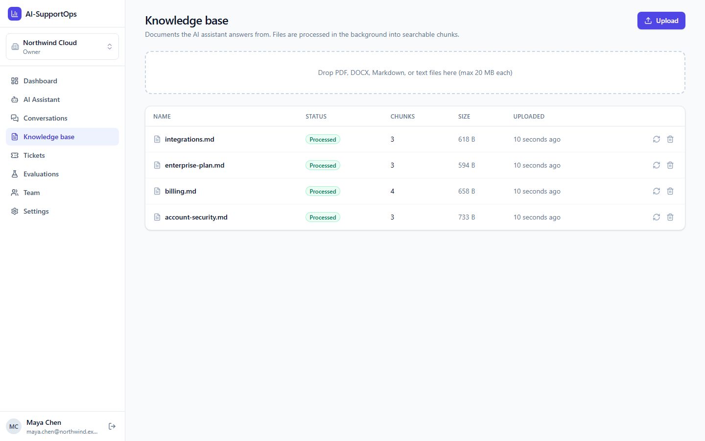 **Knowledge base**: upload and ingestion status | 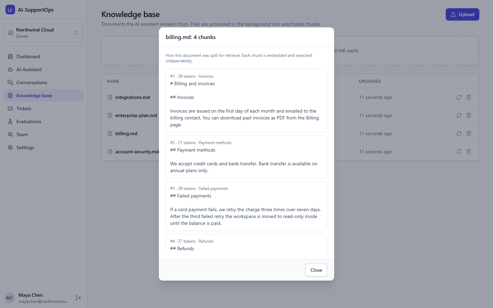 **Chunk inspector**: what the retriever actually sees |
| 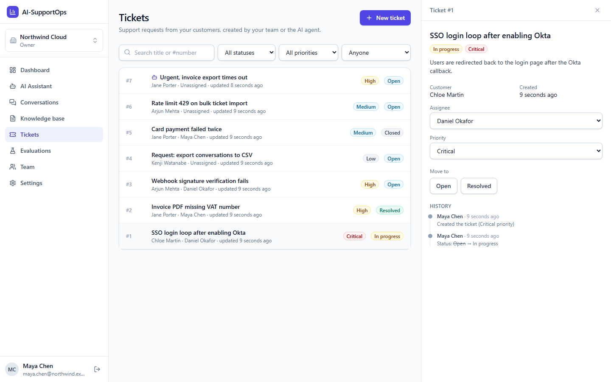 **Tickets**: filters, workflow, and a history with human and agent actors | 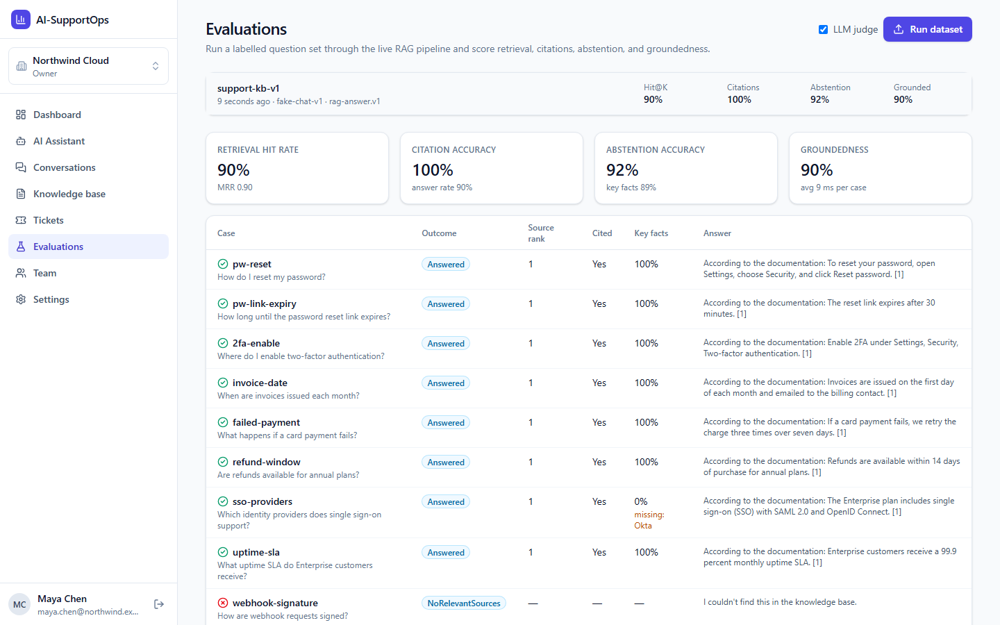 **Evaluations**: run the labelled dataset and compare runs |
| 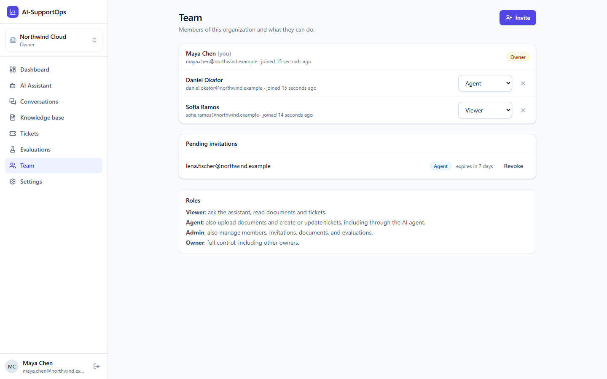 **Team**: roles and invitations | 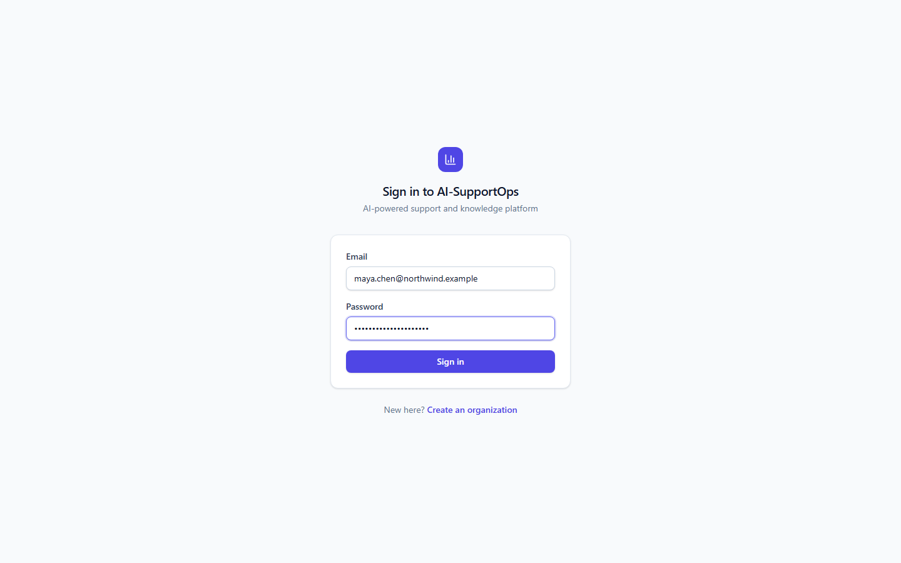 **Sign in** |

## 5. Architecture

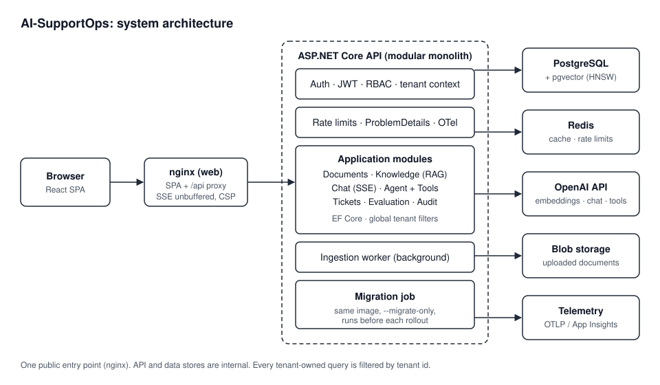

The system is a **modular monolith** with Clean Architecture layers: one deployable, with module boundaries that architecture tests enforce.

```
src/
  Domain/          Entities and invariants (no dependencies)
  Application/     Use cases per module: Identity, Tenants, Documents, Ingestion, Knowledge,
                   Chat, Tickets, Agents, Evaluation, Auditing; versioned prompts
  Infrastructure/  EF Core + PostgreSQL/pgvector, Redis, OpenAI, Blob/local storage, workers
  Api/             Minimal API endpoints, auth, rate limiting, middleware, OpenTelemetry
  Web/             React 19 + TypeScript SPA, served by nginx
tests/
  UnitTests/         Fast tests and architecture rules
  IntegrationTests/  Real PostgreSQL/pgvector, Redis and Azurite via Testcontainers
  EvaluationTests/   RAG quality gate over a labelled dataset
infra/             Bicep for Azure
```

Details: [docs/architecture.md](docs/architecture.md)

## 6. RAG pipeline

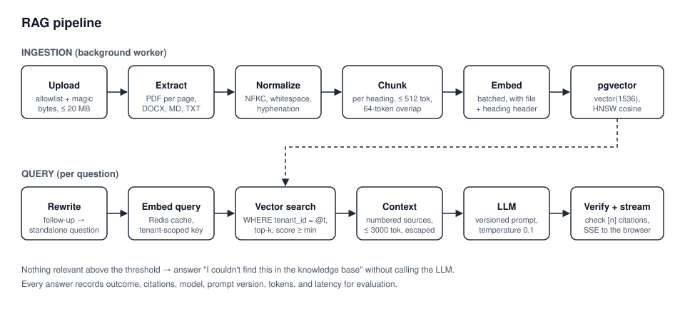

Ingestion works as a job queue on the `documents` table (`FOR UPDATE SKIP LOCKED`, leases, retry limits), so any number of API instances can process uploads safely. At query time, retrieval always carries an explicit `tenant_id` predicate. If no chunk scores above the threshold, the model is never called. The model must cite numbered sources, and the API drops citations that point to sources it did not provide.

Details: [docs/rag.md](docs/rag.md)

## 7. Agent / tool-calling flow

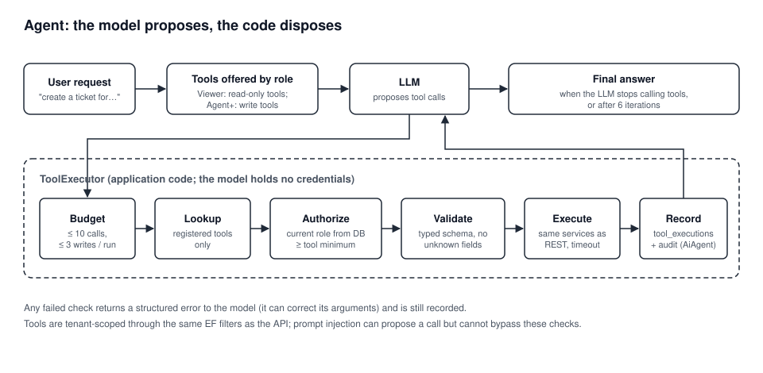

Tools are sent to the model as declarations only, so the model cannot execute anything itself. Every proposed call goes through `ToolExecutor`, which runs five checks:

1. **Budget:** at most 10 calls and 3 writes per run.
2. **Registered tool:** the call must name a tool the registry knows.
3. **Role:** the user's current role is re-read from the database.
4. **Arguments:** they are validated against the typed schema.
5. **Execution:** the tool runs through the same application services the REST API uses, and the call is recorded in `tool_executions` and the audit log with actor type `AiAgent`.

A prompt injection can make the model *propose* a call, but it cannot get that call past these checks.

Details: [docs/agentic-ai.md](docs/agentic-ai.md)

## 8. Database architecture

PostgreSQL 17 holds both the relational data and the vectors. Every table that holds tenant data has a `tenant_id` column. Ids are UUIDv7, and names are snake_case.

| Group | Tables | Notes |
|---|---|---|
| Identity and tenancy | `users`, `tenants`, `tenant_memberships`, `invitations`, `refresh_tokens` | Memberships carry the role. Refresh tokens are stored hashed and grouped into families for reuse detection. |
| Knowledge | `documents`, `document_chunks` | `documents` doubles as the ingestion queue (status, attempts, lease). `document_chunks.embedding` is `vector(1536)` with an **HNSW cosine** index. |
| Conversations | `conversations`, `messages` | Messages store citations, outcome, model, prompt version, token usage, latency and feedback. Conversations keep a rolling summary. |
| Support | `customers`, `support_tickets`, `ticket_counters` | Tickets use `xmin` for optimistic concurrency. Ticket numbers come from an atomic upsert counter per tenant. |
| Governance | `audit_logs`, `tool_executions` | Audit entries are written in the same transaction as the change they describe. |
| Evaluation | `evaluation_runs`, `evaluation_results` | Aggregate and per-case scores for each run. |

Schema changes are EF Core migrations (`src/Infrastructure/Persistence/Migrations`). In production they are applied by a separate migration job, never by the app at startup.

## 9. Tech stack

| Area | Choice |
|---|---|
| Backend | .NET 10, ASP.NET Core Minimal APIs, EF Core 10 (Npgsql) |
| Data | PostgreSQL 17 + pgvector (HNSW), Redis 7 |
| AI | Microsoft.Extensions.AI with OpenAI (text-embedding-3-small, chat and tool calling); an offline Fake provider for development and tests |
| Documents | PdfPig, Open XML SDK, cl100k tokenizer (Microsoft.ML.Tokenizers) |
| Frontend | React 19, TypeScript, Vite, TanStack Query, React Router, Tailwind CSS 4 |
| Observability | OpenTelemetry, Aspire Dashboard (local), Azure Monitor / Application Insights |
| Testing | xUnit, Testcontainers (pgvector, Redis, Azurite), Vitest, React Testing Library |
| Delivery | Docker, nginx, GitHub Actions, GHCR, Bicep, Azure Container Apps |

## 10. Local setup

Prerequisites: .NET 10 SDK, Node 24 (the version CI uses), and Docker Desktop.

```bash
cp .env.example .env              # set POSTGRES_PASSWORD, JWT_SIGNING_KEY (and ports if 5432/6379 are taken)

# Option A: everything in containers
docker compose --profile full up -d --build
curl http://localhost:8080/health/ready   # -> Healthy
# Traces, metrics, and logs: http://localhost:18888 (Aspire Dashboard)

# Option B: dependencies in Docker, API on the host (for debugging)
docker compose up -d
dotnet user-secrets --project src/Api set "ConnectionStrings:Postgres" \
  "Host=localhost;Port=5432;Database=aisupportops;Username=aisupportops;Password=<from .env>"
dotnet user-secrets --project src/Api set "ConnectionStrings:Redis" "localhost:6379"
dotnet user-secrets --project src/Api set "Auth:SigningKey" "$(openssl rand -base64 48)"
dotnet run --project src/Api

# Frontend dev server (proxies /api to http://localhost:8080)
cd src/Web && npm install && npm run dev  # http://localhost:5173
```

Development uses the offline **Fake AI provider** by default, so you need no API key to explore. To use real models:

```bash
dotnet user-secrets --project src/Api set "Ai:Provider" "OpenAI"
dotnet user-secrets --project src/Api set "Ai:OpenAI:ApiKey" "<your key>"
```

## 11. Environment variables

The templates are [.env.example](.env.example) (development) and [.env.prod.example](.env.prod.example) (production-style). The real `.env` and `.env.prod` files are git-ignored, and host runs use `dotnet user-secrets`. **No secret is committed**, and gitleaks enforces this in CI.

| Variable | Purpose |
|---|---|
| `POSTGRES_PASSWORD`, `REDIS_PASSWORD`, `JWT_SIGNING_KEY` | Required secrets (generate the signing key with `openssl rand -base64 48`) |
| `AI_PROVIDER`, `OPENAI_API_KEY`, `OPENAI_CHAT_MODEL` | `Fake` (offline) or `OpenAI`, and the chat model to use |
| `RAG_MIN_SCORE` | Retrieval relevance threshold. Calibrate it per embedding model (see [docs/evaluation.md](docs/evaluation.md)). |
| `WEB_PORT`, `API_PORT`, `POSTGRES_PORT`, `REDIS_PORT`, `DASHBOARD_PORT` | Host ports |
| `IMAGE_TAG`, `OTEL_EXPORTER_OTLP_ENDPOINT` | Image version to run; where telemetry is sent |

## 12. Docker setup

| File | Use |
|---|---|
| `docker-compose.yml` | Development: Postgres (pgvector) and Redis. With `--profile full`, also the API and the Aspire Dashboard. |
| `docker-compose.prod.yml` | Production-style: nginx (the only public port), API, a one-shot migration job, and Postgres and Redis on an internal network. |

```bash
cp .env.prod.example .env.prod   # fill in real secrets
docker compose -f docker-compose.prod.yml --env-file .env.prod up -d --build
# open http://localhost:${WEB_PORT}
```

The production compose file is hardened:

- Images are multi-stage (`aspnet:10.0-alpine` for the API, `nginx-unprivileged` for the web).
- Containers run as non-root with read-only filesystems, and the API has a `HEALTHCHECK`.
- nginx serves the SPA, proxies `/api` with SSE buffering off, and sets the CSP and other security headers.

Details: [docs/deployment.md](docs/deployment.md)

## 13. Testing

```bash
dotnet test                          # all .NET tests (integration tests need Docker)
cd src/Web && npm test && npm run lint && npm run build
```

| Suite | Count | What it covers |
|---|---|---|
| Unit | 120 | Domain rules, chunking, prompt building, citation verification, tool validation, architecture rules |
| Integration | 114 | Real PostgreSQL/pgvector, Redis and Azurite through Testcontainers. Covers auth flows, **cross-tenant isolation**, RBAC, ingestion, retrieval, streaming chat, tickets and concurrency, agent tool authorization, rate limits, security headers, and Blob storage. |
| Evaluation | 1 | The RAG quality gate over the labelled dataset (see below) |
| Frontend | 14 | API client refresh logic, SSE parser, UI components |

## 14. AI evaluation

`evaluation/dataset.json` contains labelled questions over `evaluation/docs/*.md`. Some cases are answerable, with an expected source and key facts. Others are deliberately unanswerable and should produce an abstention. Each run reports:

- **Hit@K and MRR:** did retrieval find the right document, and how high did it rank it?
- **Citation accuracy:** did the answer cite the expected source?
- **Key-fact coverage:** does the answer contain the facts a correct answer needs?
- **Abstention accuracy:** did the system decline the unanswerable questions?
- **Groundedness:** an LLM judge (a versioned prompt) scores whether every claim is supported by the provided context.

`EvaluationTests` runs the dataset in CI and fails the build when quality drops below the thresholds. The same runs can be started from the UI and compared there. Online metrics (abstention rate, citation rate, latency, tokens, feedback) appear on the dashboard.

Details: [docs/evaluation.md](docs/evaluation.md)

## 15. CI/CD

[`.github/workflows/ci.yml`](.github/workflows/ci.yml) runs on every push and pull request:

| Job | What it enforces |
|---|---|
| Backend | Build with analyzers as errors; unit, integration and evaluation tests; test results and coverage as artifacts |
| Frontend | Lint, Vitest, type check, production build |
| Security | The NuGet audit (including transitive packages) and the npm audit fail the build on vulnerabilities; gitleaks scans the full git history |
| Docker | Both images build, with layer caching |
| Publish | On `main` only, after every gate passes: push `ghcr.io/vipul2902/aisupportops-{api,web}` (tags `sha-<commit>` and `latest`) with an SBOM and provenance |

CI needs no secrets: tests use the Fake AI provider and throwaway containers.

## 16. Azure deployment


[`infra/main.bicep`](infra/main.bicep) provisions the full environment:

- **Container Apps** for the web and API apps, plus the migration job;
- **PostgreSQL Flexible Server** with the `vector` extension allow-listed;
- **Azure Managed Redis**;
- **Blob Storage** for uploads, accessed through managed identity;
- **Key Vault** (RBAC) for secrets;
- **Log Analytics and Application Insights**;
- a **VNet** that keeps the data services private.

[`.github/workflows/deploy.yml`](.github/workflows/deploy.yml) is a manual workflow. It authenticates to Azure with **GitHub OIDC**, so no stored credentials are needed. It then runs the migration job, rolls out new revisions pinned to the image SHA, and smoke-tests `/health/ready`.

> **Status:** the templates and workflow are written and documented, but they **have not been compiled with the Bicep CLI or deployed** to a live subscription for this portfolio. See [docs/deployment.md](docs/deployment.md#azure) for the steps and the items to check on first deployment.

## 17. Security

- **Tenant isolation:**
  - EF Core global query filters on every tenant-owned entity, plus a `SaveChanges` guard that rejects cross-tenant writes.
  - Raw vector SQL carries an explicit tenant predicate.
  - Cache keys are tenant-scoped.
  - Integration tests try to read and write another tenant's data and must fail.
- **Authentication:**
  - JWT access tokens last 15 minutes.
  - Refresh tokens rotate, are stored hashed, and use family reuse detection. They live in an httpOnly, `SameSite=Strict` cookie, protected by a CSRF header guard.
  - Atomic per-account lockout runs in Redis.
- **Authorization:** role policies on every endpoint. The agent's tools are filtered by role and re-authorized against the database for every call.
- **AI safety:**
  - Retrieved text is escaped and fenced as untrusted data.
  - Prompts are versioned.
  - Citations are verified.
  - The system abstains below the relevance threshold.
  - Tool calls are budgeted and audited.
- **Platform:**
  - Uploads are checked against an allowlist and magic bytes.
  - Redis rate limits apply per IP (auth) and per user (AI).
  - Security headers and a CSP are set.
  - Only known proxies are trusted.
  - Containers run as non-root with read-only filesystems.
  - Secrets come from user-secrets, `.env` files or Key Vault, never from git.

Details: [docs/security.md](docs/security.md) · Vulnerability reporting: [SECURITY.md](SECURITY.md)

## 18. Future improvements

- **Retrieval quality:**
  - hybrid search (Postgres full-text plus vectors, with reciprocal rank fusion);
  - a cross-encoder reranker;
  - per-tenant threshold calibration.
- **Ingestion:**
  - OCR for scanned PDFs;
  - table-aware extraction;
  - connectors (Confluence, Zendesk, Google Drive) with incremental sync.
- **Agent:**
  - human approval for selected write tools;
  - more tools (email reply drafts, ticket merge);
  - per-tenant tool configuration.
- **Cost:**
  - semantic answer caching;
  - routing simple questions to a smaller model;
  - per-tenant token quotas and usage billing.
- **Platform:**
  - SSO (OIDC/SAML);
  - Postgres row-level security as a second isolation layer;
  - a live Azure deployment with load tests;
  - splitting ingestion into its own service when its scaling diverges from the API.

Interview preparation notes for this project: [docs/interview-guide.md](docs/interview-guide.md)

## License

[MIT](LICENSE)
